# 📋 Gestionnaire de Projets - Application React Complète

Application React professionnelle de gestion de projets démontrant la maîtrise complète des trois hooks essentiels de React : **`useState`**, **`useEffect`** et **`useReducer`**.

**Projet Final - Cours MERN Semaine 7 | Poids : 20% de la note finale**

---

## 🎯 Objectifs Pédagogiques

Ce projet applique intégralement les concepts du cours MERN Semaine 7 :

| Hook | Objectif | Implémentation |
|------|----------|-----------------|
| **useState** | Gestion de l'état local simple | Formulaires, filtres, recherche, affichage stats |
| **useEffect** | Gestion des effets de bord | Persistance localStorage, timers Pomodoro |
| **useReducer** | Gestion d'état complexe centralisée | Logique métier des projets (CRUD) |

---

## ✨ Fonctionnalités Complètes

### 🎯 Gestion des Projets (useReducer)
- ✅ **Ajouter** un projet avec titre, description et deadline
- ✅ **Modifier** un projet existant
- ✅ **Supprimer** un projet (avec nettoyage des timers)
- ✅ **Changer le statut** : À faire → En cours → Terminé

### 🔍 Filtres et Recherche (useState)
- ✅ **Recherche** en temps réel dans titre et description
- ✅ **Filtrage** par statut (Tous / À faire / En cours / Terminé)
- ✅ **Tri** par deadline ou par titre

### ⏱️ Timer Pomodoro (useEffect + useReducer)
- ✅ Timer **25 minutes** par projet
- ✅ **Démarrer / Pause / Reprendre** le timer
- ✅ **Réinitialiser** le timer
- ✅ Gestion automatique des intervals avec nettoyage

### 📊 Statistiques Visuelles (useState + useReducer)
- ✅ Nombre **total** de projets
- ✅ Répartition par **statut** (À faire, En cours, Terminé)
- ✅ Affichage/Masquage des statistiques

### 💾 Persistance des Données (useEffect)
- ✅ Sauvegarde **automatique** dans localStorage
- ✅ Chargement au **démarrage** de l'application
- ✅ Synchronisation en **temps réel**

---

## 🛠️ Installation et Démarrage

### Prérequis
- Node.js 16+ et npm

### Étapes

```bash
# 1. Installer les dépendances
npm install

# 2. Démarrer le serveur de développement
npm run dev

# 3. Ouvrir dans le navigateur
# http://localhost:5173
```

---

## 📁 Structure du Projet (Refactorisée)

```
src/
├── components/                    # Composants React
│   ├── ProjectManager.jsx         # Composant principal (orchestration)
│   ├── Header.jsx                 # En-tête avec titre et toggle stats
│   ├── Statistics.jsx             # Affichage des statistiques
│   ├── ProjectForm.jsx            # Formulaire d'ajout/modification
│   ├── ProjectFilters.jsx         # Filtres et recherche
│   ├── ProjectList.jsx            # Grille de projets
│   └── ProjectCard.jsx            # Carte projet individuelle
│
├── hooks/                         # Custom Hooks
│   ├── useProjectReducer.js       # Reducer pour la gestion d'état
│   └── useProjectEffects.js       # Effects pour localStorage et timers
│
├── utils/                         # Fonctions utilitaires
│   └── projectUtils.js            # Filtrage, tri, statistiques
│
├── styles/                        # Fichiers CSS (séparés)
│   ├── Header.css
│   ├── Statistics.css
│   ├── ProjectForm.css
│   ├── ProjectFilters.css
│   ├── ProjectCard.css
│   ├── ProjectList.css
│   └── ProjectManager.css
│
├── App.jsx                        # Point d'entrée
├── App.css                        # Styles globaux
└── main.jsx                       # Configuration React
```

### 🏗️ Avantages de cette Architecture

- **Séparation des responsabilités** : Chaque composant a une seule responsabilité
- **Réutilisabilité** : Les composants peuvent être réutilisés facilement
- **Maintenabilité** : Code organisé et facile à modifier
- **Scalabilité** : Structure prête pour l'évolution
- **CSS modulaire** : Styles séparés et organisés

---

## 🧠 Explication Détaillée du Reducer (useReducer)

### 📍 Localisation
**Fichier** : `src/hooks/useProjectReducer.js`

### 🎯 Rôle du Reducer
Le reducer est le **cœur** de la gestion d'état. Il centralise toute la logique métier et garantit les transitions d'état prévisibles et immuables.

### 📋 Tous les Cas du Reducer

#### 1️⃣ **ADD_PROJECT** - Ajouter un projet
```javascript
case 'ADD_PROJECT':
  return {
    ...state,
    projects: [...state.projects, {
      id: Date.now(),                    // ID unique basé sur timestamp
      title: action.payload.title,
      description: action.payload.description,
      status: 'todo',                    // Statut initial
      deadline: action.payload.deadline,
      createdAt: new Date().toISOString()
    }]
  };
```
**Quand** : Lors de la soumission du formulaire  
**Immutabilité** : Création d'un nouveau tableau avec spread operator

#### 2️⃣ **UPDATE_PROJECT_STATUS** - Changer le statut
```javascript
case 'UPDATE_PROJECT_STATUS':
  return {
    ...state,
    projects: state.projects.map(project =>
      project.id === action.payload.id
        ? { ...project, status: action.payload.status }  // Mise à jour
        : project                                         // Inchangé
    )
  };
```
**Quand** : Changement du statut (todo → doing → done)  
**Immutabilité** : Utilisation de `.map()` pour créer un nouveau tableau

#### 3️⃣ **DELETE_PROJECT** - Supprimer un projet
```javascript
case 'DELETE_PROJECT':
  return {
    ...state,
    projects: state.projects.filter(project => 
      project.id !== action.payload.id  // Exclure le projet
    ),
    timers: Object.fromEntries(
      Object.entries(state.timers).filter(([key]) => 
        !key.startsWith(`project-${action.payload.id}-`)  // Nettoyer timers
      )
    )
  };
```
**Quand** : Suppression d'un projet  
**Immutabilité** : Utilisation de `.filter()` pour exclure  
**Bonus** : Nettoyage automatique des timers associés

#### 4️⃣ **EDIT_PROJECT** - Modifier un projet
```javascript
case 'EDIT_PROJECT':
  return {
    ...state,
    projects: state.projects.map(project =>
      project.id === action.payload.id
        ? {
            ...project,
            title: action.payload.title,
            description: action.payload.description,
            deadline: action.payload.deadline
          }
        : project
    )
  };
```
**Quand** : Modification des informations d'un projet  
**Immutabilité** : Spread operator pour fusionner les changements

#### 5️⃣ **SET_FILTER** - Appliquer les filtres
```javascript
case 'SET_FILTER':
  return {
    ...state,
    filters: {
      ...state.filters,
      [action.payload.key]: action.payload.value  // Mise à jour dynamique
    }
  };
```
**Quand** : Changement de filtre, tri ou recherche  
**Clé dynamique** : Permet de mettre à jour n'importe quel filtre

#### 6️⃣ **LOAD_PROJECTS** - Charger depuis localStorage
```javascript
case 'LOAD_PROJECTS':
  return {
    ...state,
    projects: action.payload  // Remplacer les projets
  };
```
**Quand** : Au démarrage de l'application (via useEffect)  
**Utilité** : Restaurer les données persistées

#### 7️⃣ **UPDATE_TIMER** - Gérer les timers Pomodoro
```javascript
case 'UPDATE_TIMER':
  return {
    ...state,
    timers: {
      ...state.timers,
      [action.payload.key]: action.payload.value  // Mise à jour du timer
    }
  };
```
**Quand** : Démarrage, pause, réinitialisation du timer  
**Clé** : Format `project-{id}-pomodoro`

### 🔐 Principe d'Immutabilité

**L'immutabilité est CRUCIALE en React !**

| Opération | ❌ INCORRECT | ✅ CORRECT |
|-----------|-------------|-----------|
| **Ajouter** | `state.projects.push(item)` | `[...state.projects, item]` |
| **Supprimer** | `state.projects.splice(i, 1)` | `state.projects.filter((_, i) => i !== index)` |
| **Modifier** | `state.projects[0].title = "X"` | `state.projects.map((p, i) => i === 0 ? {...p, title: "X"} : p)` |
| **Objet** | `state.user.name = "Bob"` | `{...state, user: {...state.user, name: "Bob"}}` |

---

## ⚡ Explication Détaillée des useEffect

### 📍 Localisation
**Fichier** : `src/hooks/useProjectEffects.js`

### 🎯 Rôle des useEffect
Les useEffect gèrent les **effets de bord** : localStorage, timers, abonnements, etc.

### 📋 Tous les useEffect Implémentés

#### 1️⃣ **useLocalStorageEffect** - Chargement au montage
```javascript
useEffect(() => {
  const savedProjects = localStorage.getItem('projects');
  if (savedProjects) {
    try {
      const projects = JSON.parse(savedProjects);
      dispatch({ type: 'LOAD_PROJECTS', payload: projects });
    } catch (error) {
      console.error('Erreur lors du chargement:', error);
    }
  }
}, [dispatch]);  // ← Dépendance : dispatch
```

**Quand** : Une seule fois au montage du composant  
**Dépendances** : `[dispatch]` - Exécution unique  
**Rôle** : Restaurer les projets sauvegardés  
**Gestion d'erreur** : Try/catch pour JSON.parse()

#### 2️⃣ **useLocalStorageEffect** - Sauvegarde automatique
```javascript
useEffect(() => {
  if (projects.length > 0) {
    localStorage.setItem('projects', JSON.stringify(projects));
  }
}, [projects]);  // ← Dépendance : projects
```

**Quand** : À chaque changement de `projects`  
**Dépendances** : `[projects]` - Exécution quand les projets changent  
**Rôle** : Persister les données automatiquement  
**Condition** : Sauvegarde seulement si projets non vides

#### 3️⃣ **useTimerEffect** - Gestion des timers Pomodoro
```javascript
useEffect(() => {
  const intervals = Object.entries(timers).map(([key, timerData]) => {
    if (timerData.isRunning && timerData.timeLeft > 0) {
      const interval = setInterval(() => {
        dispatch({
          type: 'UPDATE_TIMER',
          payload: {
            key,
            value: {
              ...timerData,
              timeLeft: timerData.timeLeft - 1  // Décrémenter
            }
          }
        });
      }, 1000);  // Toutes les 1000ms (1 seconde)
      return interval;
    }
    return null;
  }).filter(Boolean);  // Filtrer les null

  // ✅ NETTOYAGE CRUCIAL : Arrêter les intervals
  return () => {
    intervals.forEach(interval => clearInterval(interval));
  };
}, [timers, dispatch]);  // ← Dépendances
```

**Quand** : À chaque changement de `timers`  
**Dépendances** : `[timers, dispatch]`  
**Rôle** : Décrémenter les timers en cours  
**Nettoyage** : Arrêter les intervals pour éviter les fuites mémoire  
**Fréquence** : Chaque 1 seconde via `setInterval`

### 🔄 Cycle de Vie des useEffect

```
Montage du composant
    ↓
useEffect avec [] → Exécution UNIQUE
    ↓
État change
    ↓
useEffect avec [dependency] → Exécution si dependency change
    ↓
Démontage du composant
    ↓
Fonction de nettoyage (return) → Exécution
```

### 🚨 Pièges Courants et Solutions

| Piège | Symptôme | Solution |
|-------|----------|----------|
| Pas de dépendances | Boucle infinie | Ajouter `[]` |
| Mauvaises dépendances | Effet pas déclenché | Vérifier le tableau |
| Pas de nettoyage | Fuite mémoire | Ajouter `return () => {}` |
| setInterval sans nettoyage | Timers multiples | Utiliser `clearInterval()` |

---

## 🎨 Utilisation de useState

### 📍 Localisation
**Fichier** : `src/components/ProjectManager.jsx`

### 📋 Tous les useState Utilisés

#### 1️⃣ **formData** - État du formulaire
```javascript
const [formData, setFormData] = useState({
  title: '',
  description: '',
  deadline: ''
});
```
**Utilité** : Stocker les valeurs du formulaire d'ajout/modification  
**Composant** : `ProjectForm.jsx`

#### 2️⃣ **editingProject** - Projet en édition
```javascript
const [editingProject, setEditingProject] = useState(null);
```
**Utilité** : Savoir quel projet est en cours de modification  
**Valeur** : `null` (aucun) ou objet projet

#### 3️⃣ **showStats** - Affichage des statistiques
```javascript
const [showStats, setShowStats] = useState(false);
```
**Utilité** : Afficher/masquer les statistiques  
**Composant** : `Statistics.jsx`

### 📊 Tableau Comparatif des Trois Hooks

| Aspect | useState | useEffect | useReducer |
|--------|----------|-----------|-----------|
| **Complexité** | Simple | Moyen | Complexe |
| **Cas d'usage** | État simple | Effets de bord | État complexe |
| **Exemple** | Compteur | API call | Gestion app |
| **Performance** | Rapide | Optimisable | Optimale |
| **Prévisibilité** | Moyenne | Moyenne | Excellente |

---

## 📸 Captures d'écran - Démonstration Complète

### 1. **Page d'accueil / Liste de projets**
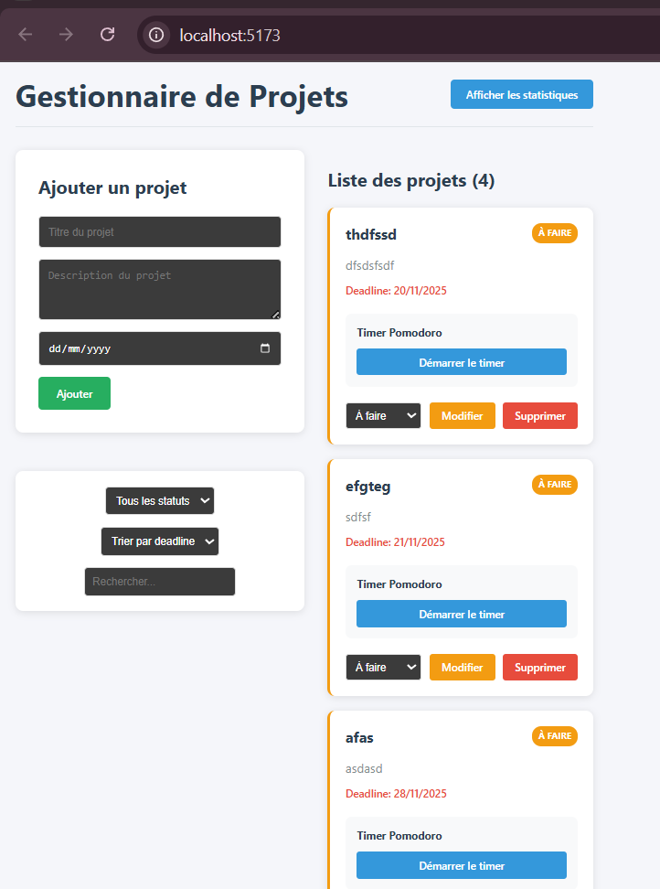
*Vue globale avec plusieurs projets, statuts visibles (badges colorés) et filtres*

---

### 2. **Formulaire d'ajout de projet**

#### Avant soumission
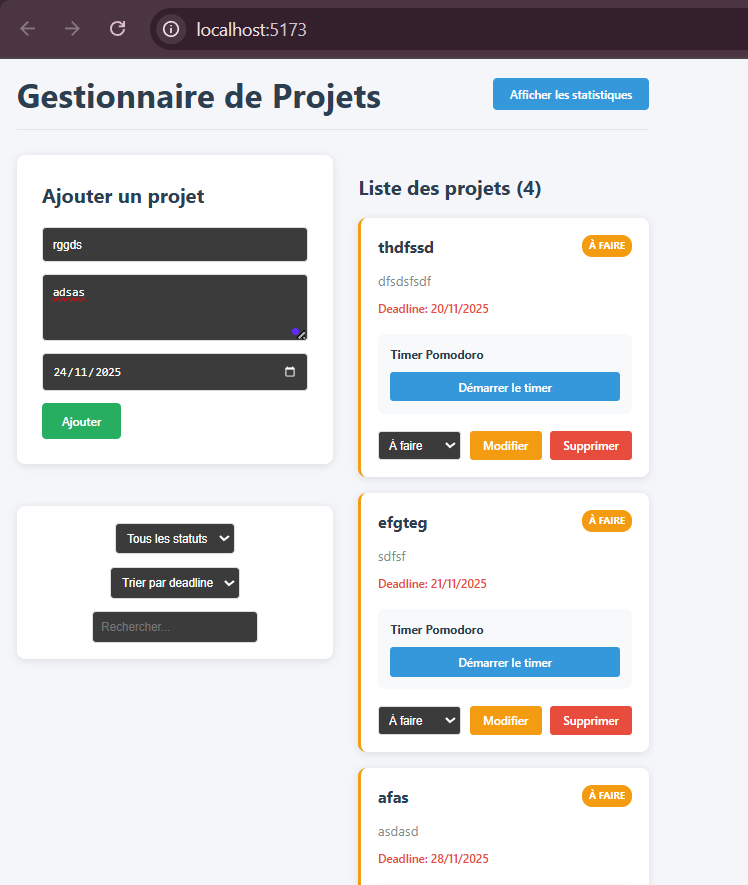
*Formulaire vide prêt à être rempli*

#### Après validation
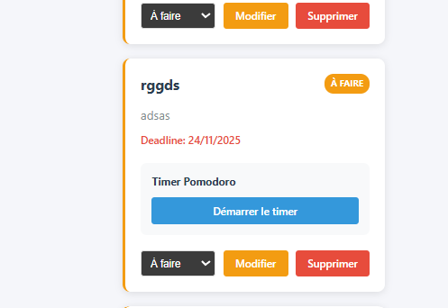
*Projet ajouté avec succès à la liste*

---

### 3. **Timer Pomodoro**

#### Timer en cours
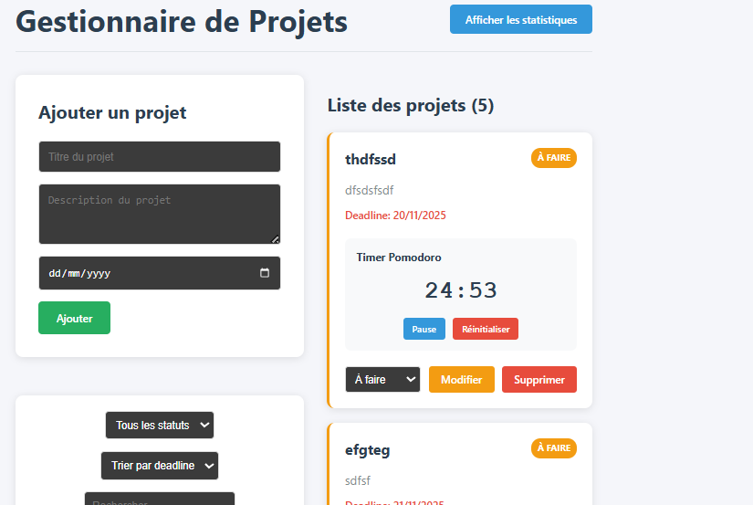
*Timer Pomodoro (25 minutes) en cours d'exécution*

#### Timer en pause
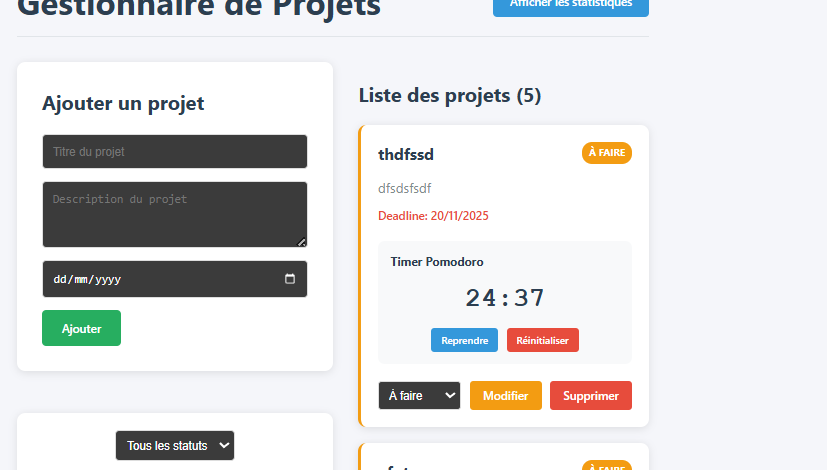
*Timer en pause, prêt à être repris*

#### Timer réinitialisé
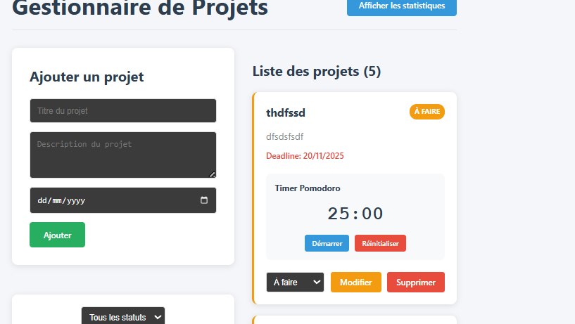
*Timer réinitialisé à 25:00*

---

### 4. **Filtrage par statut**

#### Filtre "À faire"
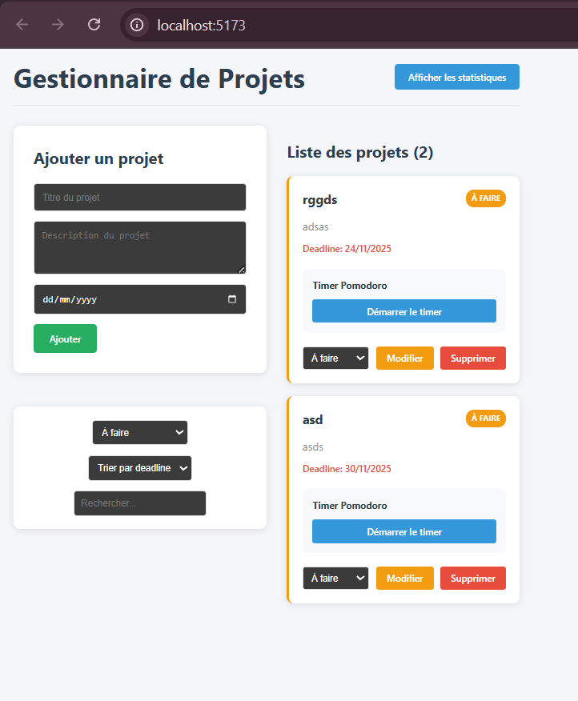
*Affichage des projets avec le statut "À faire"*

#### Filtre "En cours"
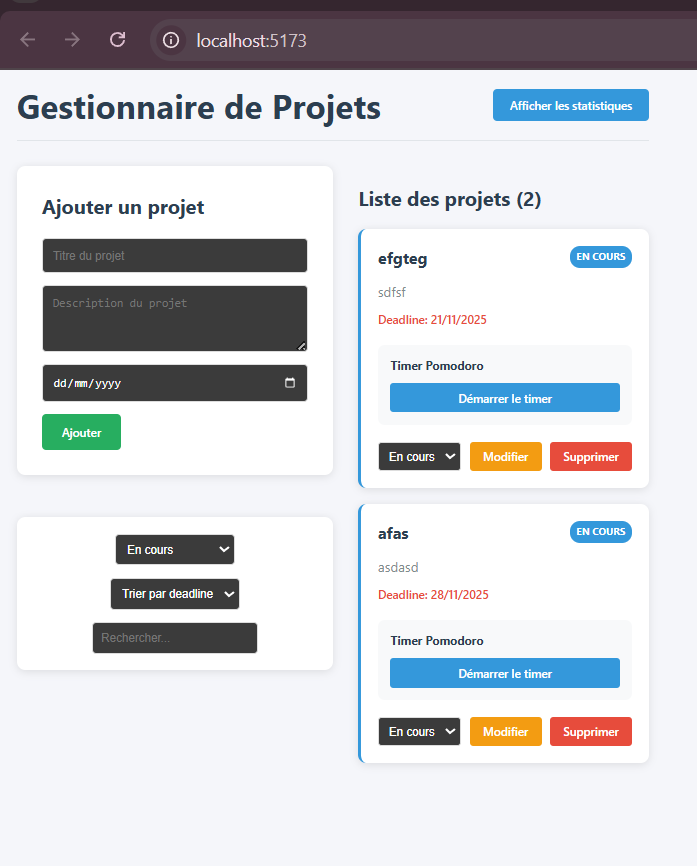
*Affichage des projets avec le statut "En cours"*

#### Filtre "Terminé"
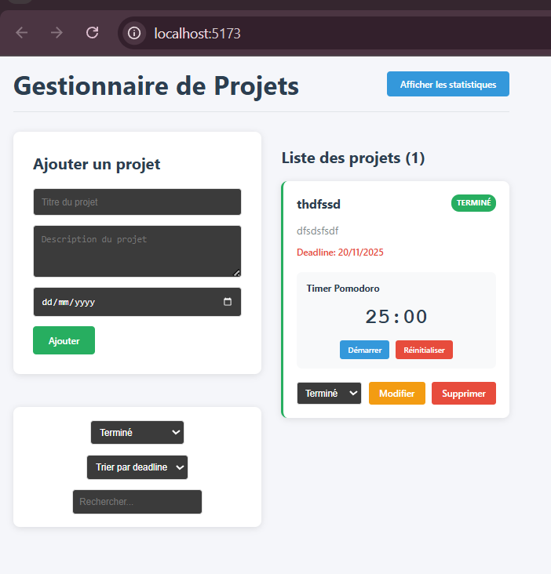
*Affichage des projets avec le statut "Terminé"*

---

### 5. **Tri par deadline**
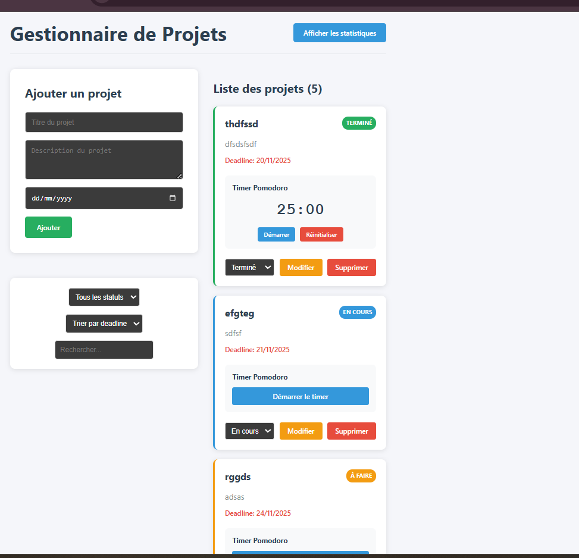
*Projets triés par deadline (du plus proche au plus loin)*

---

### 6. **Recherche**

#### Recherche par titre

*Résultats de recherche filtrés par titre du projet*

#### Recherche par description

*Résultats de recherche filtrés par description du projet*

---

### 7. **Statistiques Visuelles**

#### Affichage des statistiques
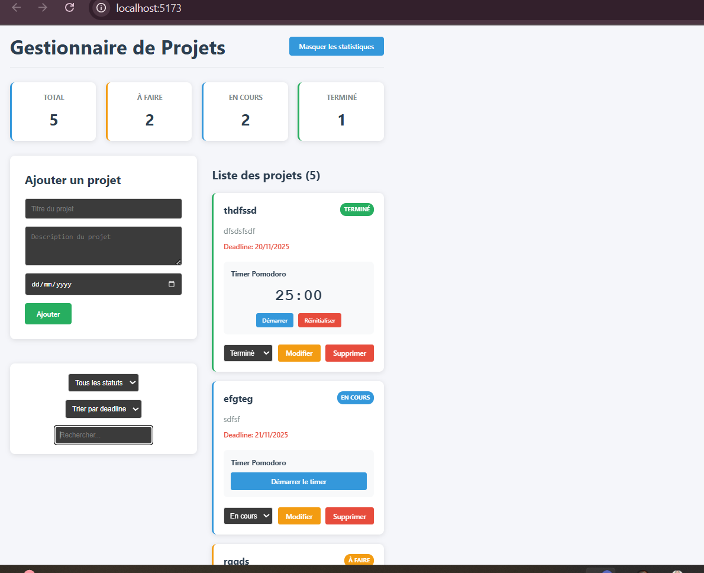
*Statistiques visibles : Total, À faire, En cours, Terminé*

#### Masquage des statistiques
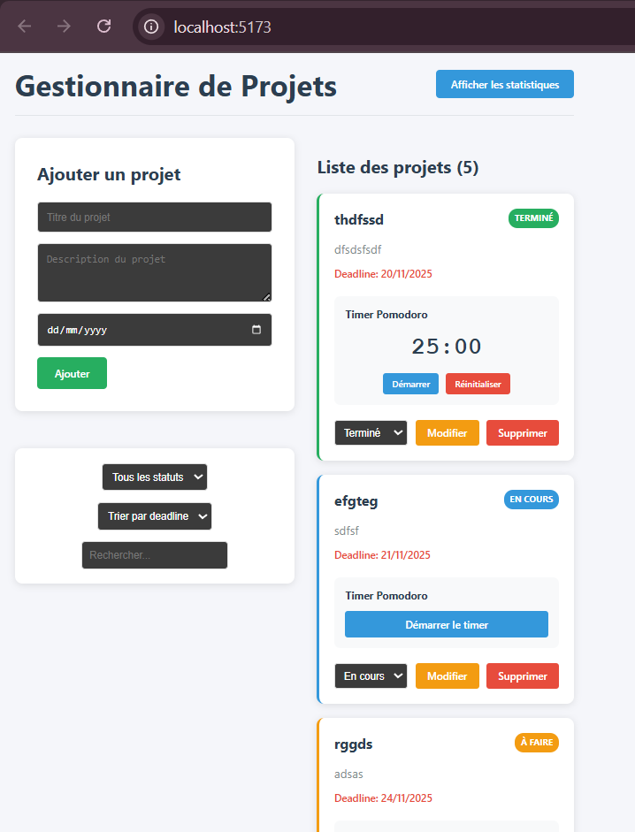
*Statistiques masquées pour plus d'espace*

---

### 8. **Gestion via useReducer**
*Les captures précédentes démontrent :*
- ✅ **Ajout de projet** : Voir "Après soumission"
- ✅ **Changement de statut** : Visible dans les filtres par statut
- ✅ **Suppression** : Bouton "Supprimer" visible sur chaque carte

---

## 🏆 Livrables Finaux

- ✅ **Code source** : Complet et fonctionnel
- ✅ **Captures d'écran** : Toutes les fonctionnalités
- ✅ **Explication reducer** : Tous les cas détaillés
- ✅ **Explication useEffect** : Chaque effect expliqué
- ✅ **README** : Documentation complète (ce fichier)


## 🚀 Améliorations Futures

- 🔐 Authentification utilisateur
- 🌙 Mode sombre
- 📱 Responsive design avancé
- 🔔 Notifications
- 📊 Graphiques avancés
- 🌍 Synchronisation cloud
- 🎨 Thèmes personnalisés

---

## 📚 Ressources

- [Documentation React Hooks](https://react.dev/reference/react)
- [MDN - localStorage](https://developer.mozilla.org/en-US/docs/Web/API/Window/localStorage)
- [Vite Documentation](https://vitejs.dev/)

---

**Développé avec ❤️ en React + Vite**  
**Cours MERN - Semaine 7 : Maîtriser les Hooks Essentiels**  
**Hooks : useState | useEffect | useReducer**  
**Projet Final - 20% de la note**
